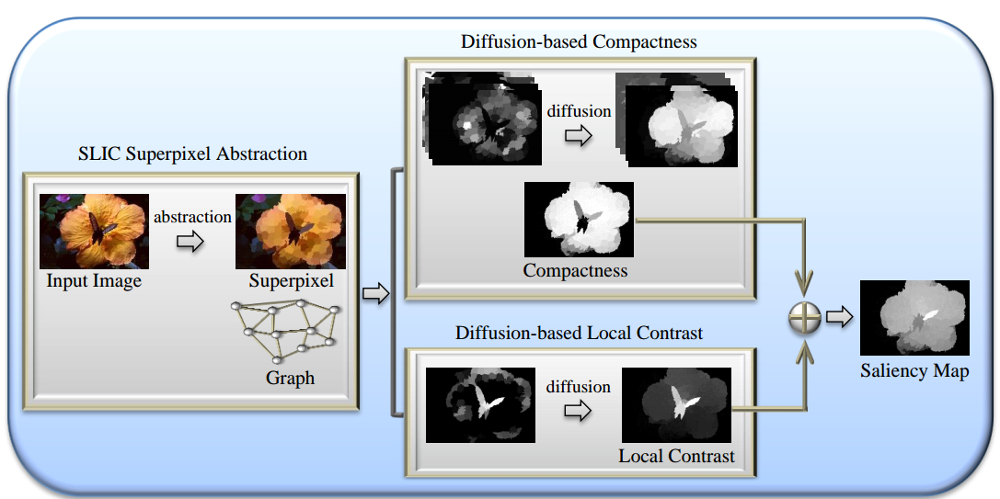
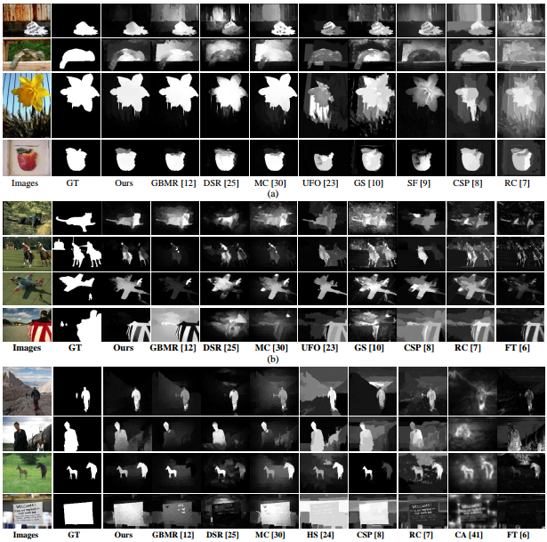

# salient-region-detection-tip15

Matlab implementation of the paper "Salient Region Detection via Integrating Diffusion-Based Compactness and Local Contrast"


## Summary


Flowchart of the proposed method. It contains three stages: abstracting the image and construction the graph; detecting saliency using diffusion-based compactness and local contrast, and generating a pixel-wise saliency map that integrates compactness and local contrast based saliency maps.

## Results


Our visual image saliency maps compared to recently developed, state-of-the-art approaches. (a) The ASD data set. (b) The SOD data set. (c) The ECSSD data set.

## Citation

If you find our work useful in your research or publication, please cite our work:

[1] Zhou L, Yang Z, Yuan Q, et al. Salient Region Detection via Integrating Diffusion-based Compactness and Local Contrast [J]. IEEE Transactions on Image Processing, 2015, 24(11):3308-3320. 

BibTeX
```
@article{Zhou2015Salient,
  title={Salient Region Detection via Integrating Diffusion-Based Compactness and Local Contrast},
  author={Zhou, L. and Yang, Z. and Yuan, Q. and Zhou, Z. and Hu, D.},
  journal={IEEE Transactions on Image Processing},
  volume={24},
  number={11},
  pages={3308-3320},
  year={2015},
}
```
